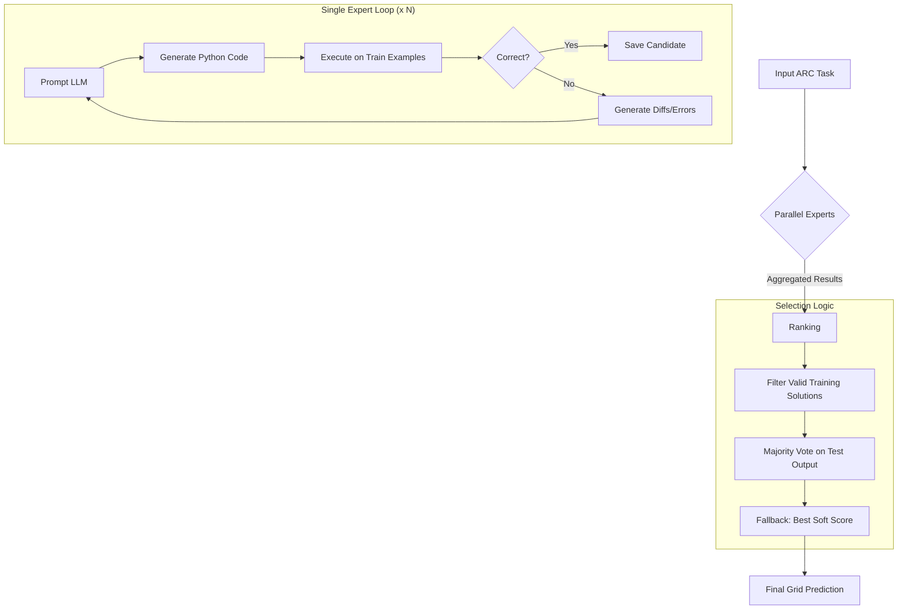

# Poetiq ARC-AGI Solver: Technical Approach Analysis

The **Poetiq ARC-AGI Solver** represents the current State-of-the-Art (SOTA) in solving the Abstraction and Reasoning Corpus (ARC). It achieves this not by training a massive new model, but by leveraging **Test-Time Compute** (inference scaling) and **Iterative Program Synthesis**.

Instead of asking an LLM to "see" the image and predict the next grid directly, the system asks the LLM to write a **Python program** that solves the task. This grounds the abstract reasoning in executable logic, reducing hallucinations and allowing for precise verification.

---

## Core Mechanism: Iterative Program Synthesis

The heart of the solver is a "Coder-Critic" loop (implemented in `solve_coding.py`) that iteratively refines a solution.

### 1. Hypothesis Generation
The system prompts an LLM (e.g., Gemini 1.5 Pro, GPT-4o) with the ARC task examples. The prompt explicitly instructs the model to:
- Analyze the examples for patterns (color, objects, spatial operations).
- Write a Python function `transform(grid: np.ndarray) -> np.ndarray`.
- Use libraries like `numpy` and `cv2` (OpenCV) for efficient grid manipulation.

### 2. Execution & Validation
Every generated program is immediately executed against the **training examples** provided in the task.
- **Pass**: The output grid perfectly matches the target.
- **Fail**: The output differs from the target.

### 3. Feedback Loop (The "Critic")
If the code fails, the system does not discard it immediately. Instead, it generates detailed feedback to feed back into the LLM for the next iteration:
- **Visual Diffs**: A representation of where the pixels differed (e.g., `prediction/correct` values).
- **Soft Score**: A percentage indicating how "close" the solution was (pixel-wise accuracy).
- **Error Traces**: Full Python stack traces if the code crashed.

The LLM uses this feedback to debug its own code, attempting to fix edge cases or logic errors. This loop repeats for a configurable number of steps (default: 10 per expert).

---

## Inference Scaling: The "Parallel Experts" Architecture

The system's high performance comes from scaling this process horizontally, as defined in `solve_parallel_coding.py`.

### Parallel Experts
Instead of running a single thinking loop, the system launches multiple independent instances ("experts").
- **Scale**: It can run 8, 100, or thousands of experts in parallel.
- **Diversity**: Each expert is seeded differently or runs with a high temperature (`1.0`) to ensure they explore different algorithmic approaches (e.g., one tries "object extraction," another tries "flood fill").

### Voting & Selection Logic
Once all experts finish, the system must choose the best answer. It uses a sophisticated ranking algorithm:

1.  **Hard Verification**: Solutions that fail to perfectly solve the *training* examples are filtered out (or strictly demoted).
2.  **Majority Vote (Self-Consistency)**: Among the experts that passed the training set, the system groups them by their output on the *test* input. The most common output is selected.
3.  **Soft-Score Fallback**: If *no* expert solves the training set perfectly, the system looks at the "failed" solutions and picks the one with the highest "soft score" (closest to correct on training data).
4.  **Diversity First**: When breaking ties, the system prioritizes diversity in the solution groups to avoid systemic bias.

---

## Architecture Diagram

## Key Configuration Parameters

The behavior is highly tunable via `config.py`:
- **`max_iterations`**: How many times an expert can "debug" its code (Default: 10).
- **`num_experts`**: The breadth of the search.
- **`llm_id`**: The backend model (supports Gemini, OpenAI, etc.).
- **`libraries`**: `numpy`, `scipy`, `cv2` are available to the LLM.

## Why This Works
1.  **Verifiability**: Unlike pure text/image generation, code can be proven correct on the training data.
2.  **Search**: It converts the problem from "reasoning" to "search." If the search space of possible Python programs is explored broadly enough, the likelihood of finding one that generalizes increases.
3.  **Language Grounding**: Python provides a precise vocabulary for visual transformations (rotation, masks, connectivity) that is often ambiguous in natural language.
